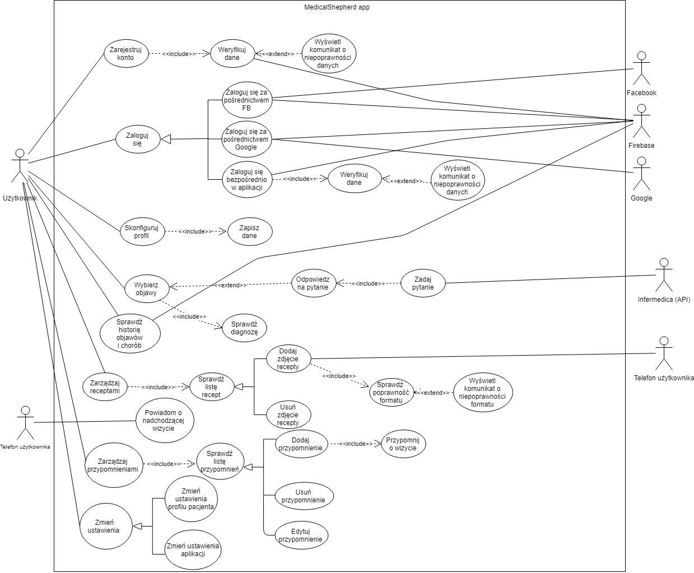

### Medical Shepherd
Medical Shepherd jest aplikacją pozwalającą zdiagnozować swoje objawy bez wychodzenia z domu, a także podpowiedzieć do jakiego specjalisty powinniśmy się udać ze swoimi schorzeniami.
### Głóne funkcjonalności aplikacji
- Diagnoza choroby

- Zapisanie zgiadnozowanej choroby

- Przypomnienie o wizycie u specjalisty

- Przechowywanie recept i zaleceń lekarza

### Diagram UML

### Linki
- Repozytorium: https://github.com/Bearsie/medical-shepherd
- Prototyp (ekrany): https://www.figma.com/file/05Cp24rVSRHaXRDqeQtRjeGP/Untitled?node-id=778%3A0
- Prototyp (klikalny):https://www.figma.com/proto/05Cp24rVSRHaXRDqeQtRjeGP/Untitled?node-id=0%3A1&scaling=scale-down
- Zarządzanie projektem: https://trello.com/b/mfucQtLq/trello-board
- Aplikacja: - phonegap link - 

### Skład zespołu
 - Patryk Maziarz
 - Grzegorz Roczniak
 - Kamil Smoleń
 - Wojciech Niedzwiedź
